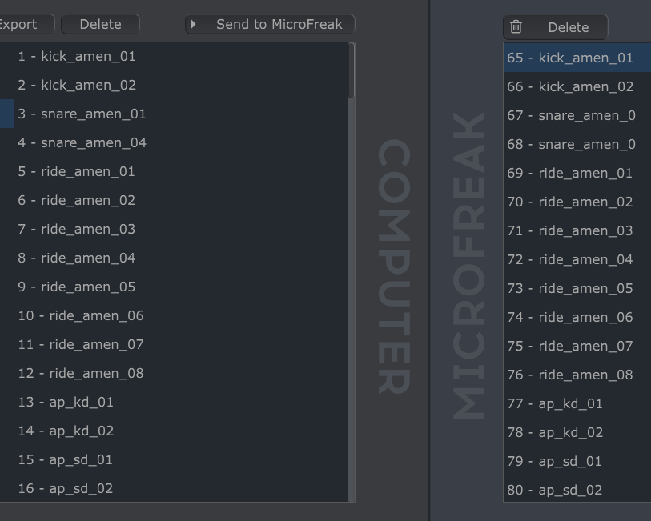

# MicroFreak-Patches
Download my custom patches for the Arturia MicroFreak

* The patch [Drumbreakz.mfpz](https://github.com/dmr-songquito/MicroFreak-Patches/blob/main/Drumbreakz.mfpz) as used in my YouTube video [Advanced Breakbeat Science on the Arturia MicroFreak v5.0](https://youtu.be/wtzsIuFOW7E)
* The patch [JumpUp.mfpz](https://github.com/dmr-songquito/MicroFreak-Patches/blob/main/JumpUp.mfpz) as used in my YouTube video [Old School Drum & Bass Vibes on the Arturia MicroFreak v5.0](https://youtu.be/gILlFgBFk9E)

Use Arturia's [MIDI Control Center](https://dl.arturia.net/products/mccu/soft/MIDI_Control_Center__1_17_0_174.exe) to transfer the patches to your MicroFreak. Note that the sample bank [BreakbeatsSeparatedDrumHits.mfsbz](https://github.com/dmr-songquito/MicroFreak-Patches/blob/main/BreakbeatsSeparatedDrumHits.mfsbz) also needs to be transferred to your MicroFreak to make them work. It is important that the samples in this bank are sent to the sample slots starting with number 65, as shown in this screenshot:

This work is licensed under <a href="http://creativecommons.org/licenses/by/4.0" target="_blank" rel="license noopener noreferrer" style="display:inline-block;">CC BY 4.0</a>
 
